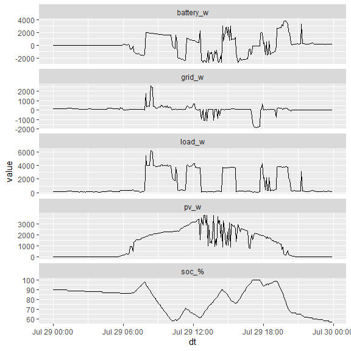

<!-- README.md is generated from README.Rmd. Please edit that file -->

# sunsynkr

<!-- badges: start -->

[](https://github.com/DavidASmith/sunsynkr/actions/workflows/R-CMD-check.yaml)
<!-- badges: end -->

`sunsynkr` is an R package to help you acquire information about Sunsynk
photovoltaic systems from their API. If you have a Sunsynk inverter and
an account to view and manage it on
[SunsynkConnect](https://sunsynk.net/), you should be able to use this
package to retrieve information about your plant.

Note that this package is unofficial and is in no way associated with
Sunsynk. It may stop working (or return misleading outputs) at any time
and without warning.

Also note that this package is currently at an early stage of
development. Functions may not work as specified and things may change
fundamentally in future versions.

## Installation

From R, you can install the current release of `sunsynkr` like so:

``` r
devtools::install_github("DavidASmith/sunsynkr")
```

## Example usage

First, load the package.

``` r
library(sunsynkr)
```

### Authentication

You must configure environment variables to hold your sunsynk username
and password (the ones you use to login to SunsynkConnect at
<https://sunsynk.net/>). Configure the following environment variables:

- `SUNSYNK_USER`
- `SUNSYNK_PASS`

### Get a token

All `sunsynkr` functions which call the API require a token as an
argument. Accordingly, you must first acquire an authentication token.

``` r
token <- get_token()
token
#> Sunsynk API token - Success 
#> Type:  bearer
#> Scope: all
```

You can now use this token to authenticate other `susynkr` functions to
the API.

### Get plants details

You can now get details of all plants associated with your account.

``` r
plants <- get_plants(token)
```

Printing the `sunsynkr_plants` object returns a tibble summarising the
information available for each plant.

``` r
plants
#> # A tibble: 1 × 7
#>   id     name        address                         pac etoday etotal update_at
#>   <chr>  <chr>       <chr>                         <int>  <dbl>  <dbl> <chr>    
#> 1 XXXXXX XXXXX XXXXX XX XXXXXXX XX, XXXXXXXXX XXX…     0   27.3  7398. 2024-07-…
```

### Flow

We can query the most recent power flow from the API for a given plant.
We can extract the plant from `plants` like this.

``` r
plant_id <- plants$data$infos[[1]]$id
```

Then, we can obtain the power flow for the plant.

``` r
flow <- get_flow(token, 
                 plant_id)
```

Printing the `sunsynkr_flow` object outputs a representation of the
power flows managed by the inverter.

``` r
flow
#>   PV    0W -----                --<--   19W Grid
#>                |    -------     |
#>                -----|     |--<--
#>                     | Inv |
#>                -->--|     |-->--
#>                |    -------     |
#> BATT  152W -->--                -->--  166W Load
#>      (89%)
```

### Day summary

You can return a summary of all power flows (and battery state of
charge) at five minute intervals for a given day.

``` r

date <- lubridate::today() - lubridate::days(1)

day_summary_table <- get_day_summary_table(token, 
                                           plant_id, 
                                           date)

day_summary_table
#> # A tibble: 288 × 6
#>    dt                   pv_w battery_w `soc_%` load_w grid_w
#>    <dttm>              <dbl>     <dbl>   <dbl>  <dbl>  <dbl>
#>  1 2024-07-30 00:00:00     0        15      57    172    162
#>  2 2024-07-30 00:05:00     0        14      57    172    160
#>  3 2024-07-30 00:10:00     0        17      57    169    154
#>  4 2024-07-30 00:15:00     0        15      57    170    155
#>  5 2024-07-30 00:20:00     0        13      57    161    161
#>  6 2024-07-30 00:25:00     0        16      56    171    159
#>  7 2024-07-30 00:30:00     0        17      56    166    149
#>  8 2024-07-30 00:35:00     0        17      56    167    153
#>  9 2024-07-30 00:40:00     0        16      56    170    157
#> 10 2024-07-30 00:45:00     0        13      56    165    153
#> # ℹ 278 more rows
```

You can also generate a plot of the day summary table.

``` r
plot(day_summary_table)
```


